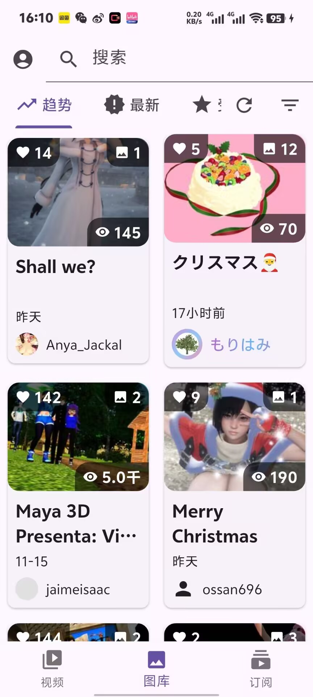
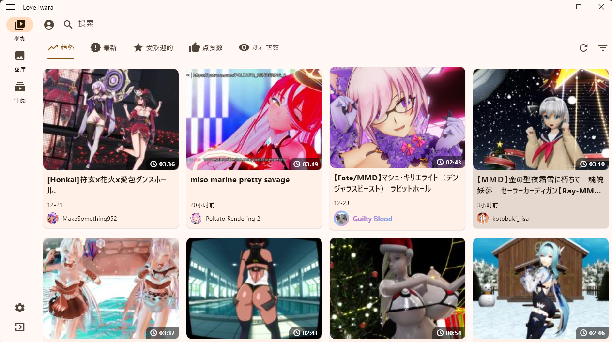

# Love Iwara (2i)

<p align="center">
  
</p>

<div align="center">

[English](#english) | [中文](README_ZH.md)

</div>

---

## English

### 🌟 Introduction
Love Iwara (also known as i_iwara or 2i) is a third-party mobile application for Iwara, built with Flutter. Our goal is to provide an excellent user experience across all devices, from mobile phones to large screens.

### ✨ Features
#### Current Features
- **🖥️ Support Platform**
    - Android
    - Windows
    - MacOS (I dont have a Mac, so I can't test it and provide the builded package)
    - Linux (I dont have a Linux Machine, so I can't test it and provide the builded package)
    - iOS (I dont have an iOS Device, so I can't test it and provide the builded package)
    - Web (Only for development use)
- **Video System**
    - Video browsing and playback
    - Video categories and tags
    - Video quality selection
    - Playback speed control
    - Full-screen support

- **Image Gallery**
    - Image browsing
    - Image zoom and pan
    - Gallery view

- **User System**
    - User authentication
    - Profile management
    - Following system

- **Social Features**
    - Comment system
    - Like/Favorite functionality

- **Multi-language Support**
    - English
    - Chinese (Simplified)
    - Chinese (Traditional)
    - Japanese

#### Upcoming Features
- **Download Management**
- **Forum System**
- **Enhanced User Experience**
  
### 📱 Screenshots
<div align="center">
  
  
  
  
</div>

### 🛠️ Development Setup
```bash
# Clone the repository
git clone [repository-url]

# Install dependencies
flutter pub get

# Run the app
flutter run
```

### ⚠️ Important Notice
This project is a Flutter learning initiative intended for educational purposes only. Please note:

- **Educational Purpose**: This is a learning project as I'm new to Flutter development.
- **No Commercial Use**: Distribution or promotion on any platform is strictly prohibited. Violations may result in repository deletion or maintenance discontinuation.
- **Known Limitations**: As a learning project, it may contain significant issues including but not limited to:
  - Performance issues
  - Memory leaks
  - Application freezes
  - Other unexpected behaviors

### 🌍 Internationalization
Currently, the internationalization texts are generated using GPT. If you'd like to contribute to translations, please refer to the Simplified Chinese template at [lib/i18n/zh-CN.i18n.yaml](lib/i18n/zh-CN.i18n.yaml).

### 💬 Feedback
For suggestions or bug reports, please submit an issue in the repository's issue tracker.

### 🙏 Acknowledgments
This project wouldn't be possible without the inspiration and learning from these amazing projects:

- [iwrqk/iwrqk](https://github.com/iwrqk/iwrqk) - An excellent Flutter implementation of Iwara client
- [wgh136/PicaComic](https://github.com/wgh136/PicaComic) - A well-structured Flutter comic application

Many of the implementations and best practices in this project were learned from these repositories.
