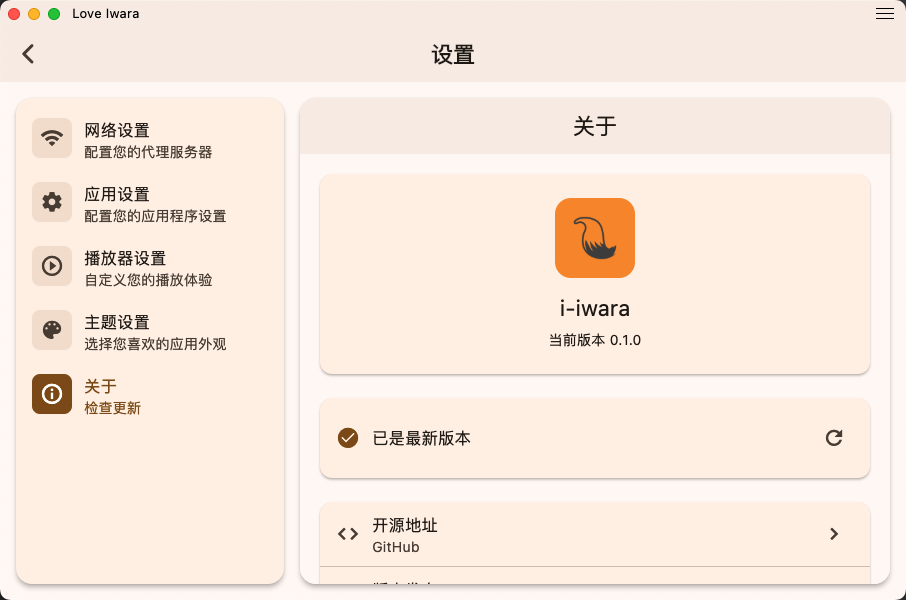
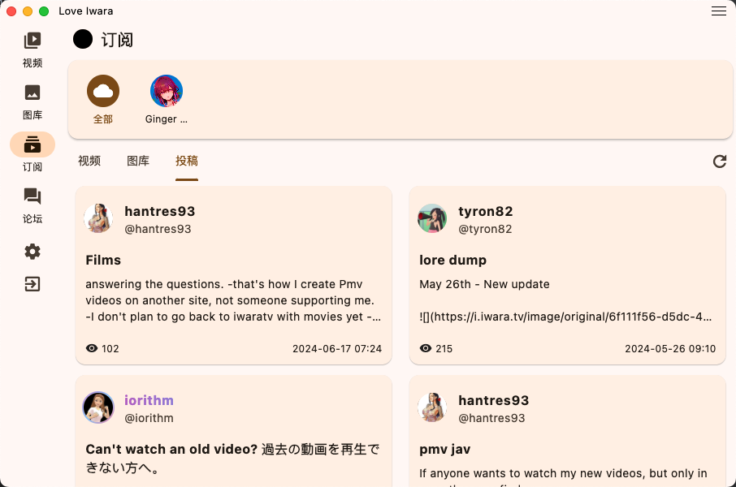
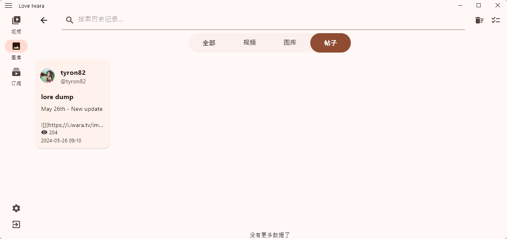
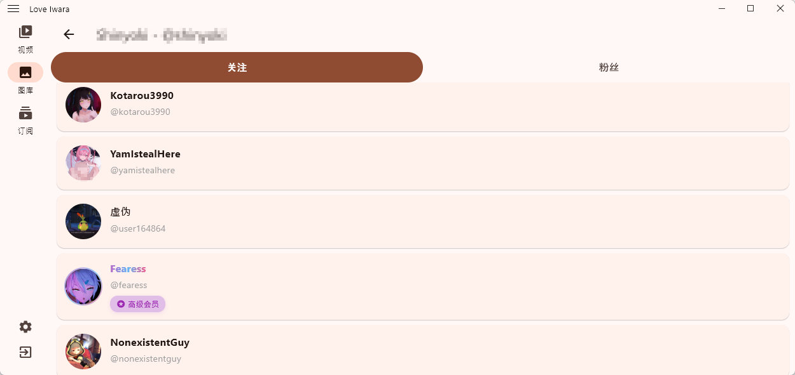
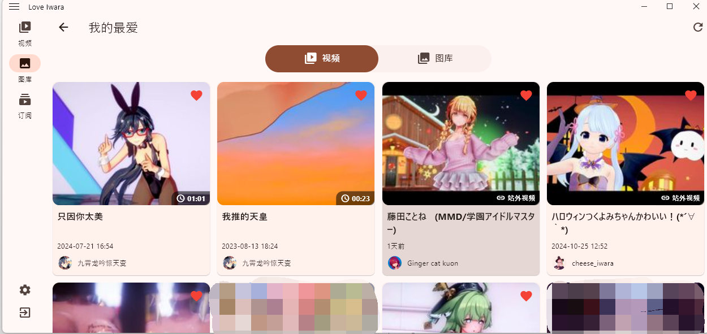

# Love Iwara (2i)

<p align="center">
  
</p>

<div align="center">

[English](README.md) | [中文](#中文)

</div>

---

## 中文

### 🌟 简介
Love Iwara（又名 i_iwara 或 2i）是一个使用 Flutter 构建的 Iwara 第三方移动应用。我们的目标是为用户提供出色的使用体验，支持多种平台和设备，包括手机、平板电脑和计算机，兼容安卓、Windows等操作系统。

### ⚠️ 项目说明
作为一名 Flutter 新手，这是我第一次尝试开发跨平台应用。项目中可能存在不少不规范的地方，代码也有待优化，但主要目的是通过实践来学习和理解 Flutter 开发。

- **学习目的**
  - 熟悉 Flutter 开发基础
  - 理解跨平台应用开发流程
  - 记录学习过程中的心得体会

- **项目状态**
  - 目前处于学习探索阶段
  - 代码可能不够规范完善
  - 功能实现以学习为主要目的

- **使用提醒**
  - 本项目仅供学习参考
  - 不建议用于生产环境
  - 欢迎其他学习者交流讨论

- **使用限制**
  - 严禁在任何平台进行宣传推广
  - 如有违反，将采取包括但不限于停止维护、删除仓库等措施

- **已知问题**
  - 由于经验有限，项目可能存在性能优化空间
  - 部分功能可能不够完善
  - 欢迎提出建议帮助改进

感谢理解与支持！如果你也是 Flutter 初学者，希望我们能在学习过程中共同进步。

### ✨ 功能特性
#### 当前功能
- **🖥️ 支持平台**
    - 📱 Android
    - 🪟 Windows
    - 🍎 MacOS（由于没有属于自己的 Mac 设备，暂无法测试以及提供构建好的安装包; 理论上UI Bug与Windows版一致，但未经过完整测试）
    - 🐧 Linux（由于没有 Linux 设备，暂无法测试以及提供构建好的安装包）
    - 📱 iOS（由于没有属于自己的 iOS 设备，暂无法测试以及提供构建好的安装包）
    - 🌐 Web（仅用于开发）

- **🔍 搜索**
    - 搜索视频/图库/帖子/用户

- **📜 历史记录**
    - 浏览历史: 视频/图库/帖子

- **🔄 翻译**
    - 翻译视频描述/图库描述/帖子/评论

- **🎥 视频**
    - 视频播放
    - 视频标签
    - 视频清晰度选择
    - 播放速度控制
    - 全屏支持

- **🖼️ 图库**
    - 图片浏览
    - 图片缩放和平移
    - 图库视图

- **📝 帖子**
    - 浏览/评论

- **💬 评论**
    - 评论浏览
    - 评论回复

- **👤 用户系统**
    - 用户认证
    - 个人资料管理
    - 关注系统

- **🌍 多语言支持**
    - 英语
    - 简体中文
    - 繁体中文
    - 日语

#### 即将推出的功能
- **下载管理**
- **站内消息通知**
- **分享**
- **论坛系统**
- **增强用户体验**
- **其他**


### 📱 截图展示
| | |
|:-------------------------:|:-------------------------:|
|||
|||
|||
|||
|||

### 🛠️ 开发环境设置

#### 前置要求
- Flutter SDK (建议最新稳定版)
- Dart SDK
- Git
- IDE 推荐:
  - Android Studio / Cursor
  - VS Code / Cursor + Flutter 插件

#### 平台特定要求

**Windows 开发环境:**
- Windows 10 或更高版本 (64-bit)
- Visual Studio 2022 或更新版本
- Windows 10 SDK
```bash
# 检查 Windows 开发环境
flutter doctor -v
```

**macOS 开发环境:**
- macOS (最新版本推荐)
- Xcode (最新版本)
- CocoaPods
```bash
# 安装 CocoaPods
sudo gem install cocoapods
```

**Linux 开发环境:**
```bash
# Ubuntu/Debian
sudo apt-get install clang cmake ninja-build pkg-config libgtk-3-dev liblzma-dev

# Fedora
sudo dnf install clang cmake ninja-build gtk3-devel
```

**Android 开发环境:**
- Android Studio
- Android SDK
- Android 模拟器或实体设备

**iOS 开发环境:**
- Xcode
- iOS 模拟器或实体设备
- Apple 开发者账号（发布需要）

#### 项目设置
```bash
# 1. 克隆仓库
git clone [仓库地址]
cd [项目目录]

# 2. 检查 Flutter 环境
flutter doctor

# 3. 获取依赖
flutter pub get

# 4. 启动开发
# 运行在默认设备上
flutter run

# 指定平台运行
flutter run -d windows  # Windows
flutter run -d macos   # macOS
flutter run -d linux   # Linux
flutter run -d chrome --web-browser-flag "--disable-web-security" # Web & 禁用安全检查，防止跨域问题
flutter run -d android # Android
flutter run -d ios     # iOS

# 5. 构建发布版本
# Android
flutter build apk --release
flutter build appbundle --release

# iOS
flutter build ios --release

# Windows
flutter build windows --release

# macOS
flutter build macos --release

# Linux
flutter build linux --release

# Web
flutter build web --release
```

#### 常用开发命令
```bash
# 生成国际化文本
dart run slang

# 清理构建缓存
flutter clean

# 更新 Flutter SDK
flutter upgrade

# 分析代码
flutter analyze

# 运行测试
flutter test

# 查看已连接设备
flutter devices

# 创建新页面/组件
flutter create component_name
```

#### 注意事项
1. 确保各平台的开发环境正确配置
2. iOS 开发需要 macOS 系统
3. 定期更新 Flutter SDK 和依赖
4. 使用 `.gitignore` 排除不必要的文件
5. 遵循 Flutter 官方的最佳实践指南

#### 常见问题解决
```bash
# 依赖冲突解决
flutter pub cache repair
flutter clean
flutter pub get

# 模拟器问题
flutter emulators
flutter emulators --launch <emulator_id>

# 开发工具重置
flutter config --clear-features
```

这些设置涵盖了 Flutter 全平台开发的主要方面。根据具体项目需求，可能需要额外的配置或工具。建议定期查看 Flutter 官方文档以获取最新的开发指南和最佳实践。

### 🌍 国际化
目前项目的国际化文本主要通过 GPT 生成。如果您愿意协助改进翻译，请参考简体中文模板文件：[lib/i18n/zh-CN.i18n.yaml](lib/i18n/zh-CN.i18n.yaml)。

### 💬 反馈建议
如果您有任何建议或发现任何 bug，欢迎在项目的 issues 区提交反馈。

### 🙏 致谢
本项目的开发过程中受到了以下优秀项目的启发：

- [iwrqk/iwrqk](https://github.com/iwrqk/iwrqk) - 优秀的 Flutter 实现的 Iwara 客户端
- [wgh136/PicaComic](https://github.com/wgh136/PicaComic) - 结构良好的 Flutter 漫画应用

项目中的许多实现方式和最佳实践都是从这些仓库中学习得来。 